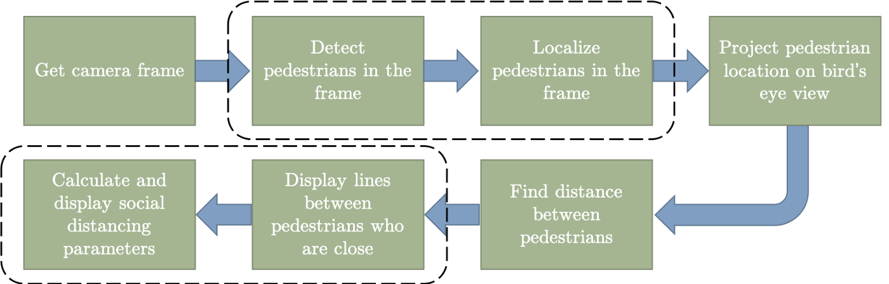

# SocialDistancingAI
Using python, deep learning and computer vision to monitor social distancing.
Idea Credits: LandingAI

[](https://www.youtube.com/watch?v=kxFwbn7Tap0&feature=emb_title)

# How to install?
It’s advisable to [make a new virtual environment](https://towardsdatascience.com/setting-up-python-platform-for-machine-learning-projects-cfd85682c54b) for this project and install the dependencies. Following steps can be taken to download get started with the project

## Clone the repository
```
git clone https://github.com/aqeelanwar/SocialDistancingAI.git
```
## Install required packages
The provided requirements.txt file can be used to install all the required packages. Use the following command

```
cd SocialDistancingAI
pip install –r requirements.txt
```


## Run the project
```
cd SocialDistancingAI
python main.py --videopath "vid_short.mp4"
```

Running main.py will open a window of the first frame in the video. At this point the code expects the user to mark 6 points by clicking appropriate positions on the frame.

#### First 4 points:
The first 4 among the 6 required points are used to mark the Region of Interest (ROI) where you want to monitor. Moreover, the lines marked by these points should be parallel lines in real world as seen from above. For example these lines could be the curbs of the road.
These 4 points need to be provided in a pre-defined order which is following.

* __Point1 (bl)__: Bottom left
* __Point2 (br)__: Bottom right
* __Point3 (tl)__: Top left
* __Point4 (tr)__: Top right


#### Last 2 points:
The last two points are used to mark two points 6 feet apart in the region of interest. For example this could be a person's height (easier to mark on the frame)

The gif below will help understand the points better


## How does it work?
The complete block diagram of the algorithm can be seen below.


A detailed article on the working of this project can be found [here](https://medium.com/@aqeel.anwar/monitoring-social-distancing-using-ai-c5b81da44c9f)

__Idea credits: LandingAI__
